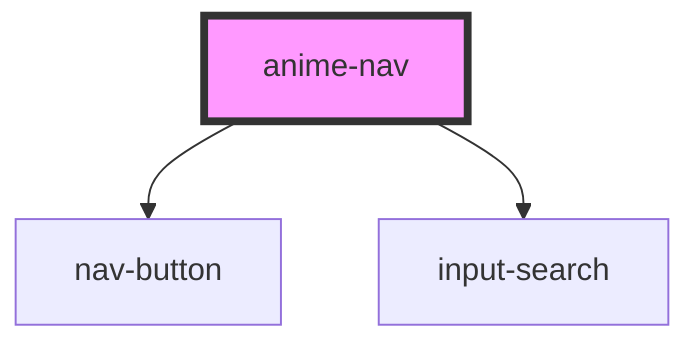

# anime-nav

<!-- Auto Generated Below -->

## Properties

| Property      | Attribute     | Description | Type     | Default         |
| ------------- | ------------- | ----------- | -------- | --------------- |
| `directorios` | `directorios` |             | `string` | `'Directorios'` |
| `horarios`    | `horarios`    |             | `string` | `'Horarios'`    |
| `inicio`      | `inicio`      |             | `string` | `'Inicio'`      |
| `recientes`   | `recientes`   |             | `string` | `'Recientes'`   |

## Dependencies

### Depends on

- [nav-button](../buttons/nav-button)
- [input-search](input-search)

### Graph

----------------------------------------------

*Built with [StencilJS](https://stenciljs.com/)*
